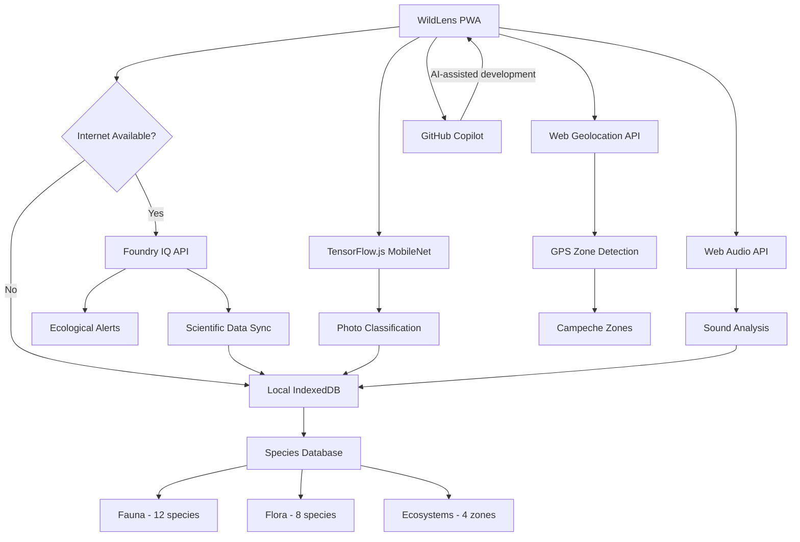

# WildLens 🌿
"Nature speaks. WildLens listens."

## The Problem

Biodiversity is declining globally at an alarming rate, and many frontline conservation efforts happen far from reliable internet connectivity. Field biologists, community naturalists, and park rangers working in remote reserves often lack lightweight, offline tools that can help them identify species, record observations, and connect those observations back to scientific data.

There is also a growing gap between authoritative scientific datasets and what field teams observe on the ground. Scientific catalogs and alerts exist, but they are typically server-bound and impractical for in-field use. WildLens addresses these problems by providing an offline-first Progressive Web App that brings identification, audio analysis, and an auditable field journal directly onto the user's device.

## What is WildLens?

WildLens is an offline-first Progressive Web App (PWA) designed to help people explore and document biodiversity in Campeche, México. The app bundles a compact species catalog, on-device image and audio identification models, a field journal, and tools for offline GPS-based zone detection — all optimized for use on low-connectivity mobile devices.

Built for field use, WildLens prioritizes reliability and local-first operation: models and essential data are cached on the device so teams can work uninterrupted in reserves, wetlands, and coastal zones. When connectivity is available, WildLens can optionally synchronize with a scientific intelligence layer (Foundry IQ) to enrich species data and fetch ecological alerts.

## Features

- 🌄 **EcoScan** — Single-tap camera capture that runs a MobileNet-based classifier on-device and produces fast image-based species suggestions with confidence scores.
- 🌿 **FloraID** — A curated flora catalog and image matcher focused on local trees and plants, including notes on toxicity and uses.
- 🦎 **FaunaID** — Compact fauna classification for mammals, birds, and reptiles common in Campeche with species cards and IUCN status.
- 🎙️ **BioListen** — Record ambient audio, visualize frequency content, and run a heuristic on-device audio classifier to suggest likely species vocalizations.
- 🔊 **SoundCard** — Play synthetic or sample-based reference sounds for species to aid in field confirmation and outreach.
- 📓 **Field Journal** — Store photo/audio-backed sightings, notes, location, and timestamps in an IndexedDB-backed journal that works fully offline.
- 📍 **Offline GPS** — Zone detection using the Web Geolocation API and a small offline mapping of Campeche zones to tag observations without network access.
- 🔗 **Foundry IQ Sync** — Optional online synchronization that enriches local records with authoritative scientific metadata and ecological alerts when internet is available.

## Architecture



## Tech Stack

| Layer | Technology |
|-------|-----------|
| Frontend | React 18 + TypeScript |
| Build Tool | Vite + PWA Plugin |
| Styling | Tailwind CSS |
| On-device AI | TensorFlow.js + MobileNet |
| Audio Analysis | Web Audio API |
| Offline Database | IndexedDB (Dexie.js) |
| GPS | Web Geolocation API |
| Intelligence Layer | Microsoft Foundry IQ |
| AI Dev Tool | GitHub Copilot in VS Code |
| Deployment | Vercel |

## Microsoft IQ Integration

When internet is available WildLens can synchronize with a Foundry IQ endpoint to enrich species records, pull authoritative metadata, and retrieve ecological alerts for regions of interest. Sync operations are opt-in and authenticated via environment variables. If credentials are not provided the app runs in `DEMO_MODE`, using local mock responses so users can test sync behaviors without exposing keys.

## Getting Started

### Prerequisites
- Node.js 18+
- npm 9+

### Installation

```bash
git clone https://github.com/Gabrielgech/wildlens.git
cd wildlens
npm install
npm run dev
```

### Environment Variables (optional)

```bash
cp .env.example .env
# Add your Foundry IQ credentials for live sync
# App works in DEMO_MODE without credentials
```

## Offline Usage

WildLens works completely offline after the first load. Install it as a PWA on your device for the best field experience — models and essential data are cached so identification and journaling continue without network access.

## Target Region

Initial database covers **Campeche, México** — including:
- Calakmul Biosphere Reserve (Selva Maya)
- Laguna de Términos (wetlands)
- Coastal mangroves
- Champotón area

## Species Database

- 12 fauna species (mammals, birds, reptiles)
- 8 flora species (trees, plants, toxic/edible)
- 4 ecosystems with risks and curiosities
- Real scientific data with conservation status (IUCN)

## Hackathon

Built for **Agents League Hackathon 2026** — Creative Apps track. AI-assisted development with **GitHub Copilot** in VS Code. Intelligence layer: **Microsoft Foundry IQ**.

## Roadmap

- [ ] Expanded species database (100+ species)
- [ ] AR camera overlay mode
- [ ] Community BioMap (shared sightings)
- [ ] Audio ML model trained on Campeche species
- [ ] Offline maps (OpenStreetMap tiles)

## License

MIT License — © 2026 WildLens
